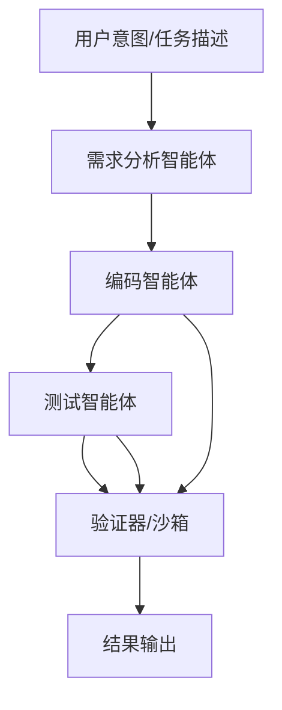

“液态软件”是一种基于人工智能按需生成、用后即销毁的即时应用架构。与传统固化的软件产品不同，液态软件在用户提出目标后由智能体（如大型语言模型）实时生成所需功能，以后即刻销毁，不占用长期存储【15†L46-L53】【52†L96-L100】。例如，Vercel首席执行官Guillermo Rauch预测未来应用将“按需生成而非下载安装”，即“临时的应用”【6†L69-L73】。硅谷投资人也指出，公司将不再购买软件使用权（seat license），而是按“结果”付费——比如“购买成交的合同”【12†L77-L83】。总体而言，液态软件代表了一种“结果即服务”的模式：软件产品不再以静态形式存在，而是在需要时被调度生成，用后消失【12†L81-L83】【15†L46-L53】。  

本报告深入探讨液态软件的定义和分类，分析其技术架构（包括智能体模型、编排系统、代码生成模块、运行时沙箱等）和赋能技术（如大型语言模型、程序合成、WebAssembly、容器、Serverless、边缘计算、安全飞地、形式化验证等）；评估其安全、隐私与合规风险（数据泄漏、血统追踪、可审计性、用户同意、日志记录等）及缓解措施；研究其用户体验和开发者工作流；比较性能、可扩展性与可靠性权衡；分析商业模式和市场机会；讨论法律和知识产权影响；总结典型实现模式与参考设计；并提出开放研究挑战和 3–5 年发展路线图。报告最后提供了现有项目与产品的对比表、推荐架构的 Mermaid 图示，以及风险矩阵表格。  

# 定义与术语分类  

**液态软件（Liquid Software）**：指按用户意图即时生成的临时应用，用后立即销毁，具有“随取随用，用后即散”的特性【15†L46-L53】【52†L96-L100】。它**没有固定形态**，仅为满足特定需求而在短暂时刻凝结成形，任务完成后不留痕迹【15†L46-L53】【52†L96-L100】。微可智能（vcorp）等厂商形象地描述液态软件为“像水一样流动的智能系统”、“无处不在却无迹可寻【15†L46-L53】”；OpenAI团队也指出，未来的用户界面将“按需生成、用完即销毁”【17†L84-L90】。 换言之，液态软件追求**一次性定制**（one-off）解决方案，极致契合用户当下需求，规避传统软件的冗余与复杂性【15†L46-L53】【52†L96-L100】。  

**相关术语**：  
- **按需软件（On-demand Software）/即时应用（Ephemeral App）**：与液态软件类似，指通过智能体实时生成的临时应用，只为当前任务或情景服务，并在完成后销毁【17†L44-L52】【44†L49-L57】。Tobias Kirsch等研究者将其定义为“生成后只使用一次或很短时间然后丢弃、不再维护的代码”【52†L96-L100】。设计领域称之为“瞬时界面（Ephemeral UI）”——基于用户上下文动态拼装的临时界面，任务完成后便消失【44†L49-L57】【44†L119-L122】。  
- **智能体生成应用（Agent-Generated App）/迷你应用（Mini App）**：指由AI智能体生成的小型应用，这些应用可能会持续存在一段时间，并可独立运行于环境中。例如Base44提出的“Superagents”可以创建可持续的迷你应用并长期运行，但也可能在任务结束后被删除【19†L222-L227】【49†L171-L179】。因此，可视为介于传统软件和纯粹一次性软件之间的模式。  
- **可丢弃软件（Disposable Software）**：与上述同义，强调软件使用即丢弃。例如Vercel团队称其为“disposable app”，即“即时生成功能足够的代码，完成目的后丢弃”的一次性软件【17†L93-L98】。  

**分类对比**：根据生成方式和生命周期，可将软件划分为：传统静态软件（预先开发、长期维护）、按需临时软件（任务结束即销毁）、以及智能体生成的小型应用（可能长期存在但按需创建）。下表列出主要特点：  

- **传统软件**：功能预先开发、版本化发布、持续维护，长期占用资源。  
- **液态/临时软件**：基于需求动态生成、短期使用后销毁；极致定制但难以复用和审核【52†L96-L100】【15†L46-L53】。  
- **智能体生成小应用**：由AI创建，可能保留以供重复使用（如Base44 Superagents持续运行并记忆用户偏好【49†L171-L179】【49†L187-L195】），也可选择生命周期结束后删除。  

以上术语多在近期技术和投资讨论中出现，例如硅谷风投认为未来用户不会再“买席位（seat）”，而是“买结果（closed deals）”，即软件按目标完成付费【12†L77-L83】；行业分析预测未来企业应用将广泛嵌入AI智能体，传统SaaS份额或被“AI生态系统”取代【17†L139-L144】【12†L77-L83】。总之，“液态软件”标志着软件交付模式从静态产品向动态服务转变。  

# 技术架构与关键组件  

液态软件的实现涉及多层次技术架构，通常包含：用户意图表达层、智能体决策与编排层、代码生成层、运行时环境层以及监控与销毁层。其核心组件包括智能体模型、编排引擎、代码生成模块、运行时沙箱、状态管理和持久化系统、API接口集成、以及类似CI/CD的自动化流程等。下图给出了一个典型架构示意：用户提出自然语言需求，由AI智能体解析并生成代码，在安全沙箱中运行应用实例，完成任务后应用自动销毁。  

```mermaid
graph LR
    user((用户))
    intent["自然语言/指令"]
    agent["AI 智能体 (LLM)"]
    codegen["代码生成模块"]
    sandbox["运行时沙箱 (WASM/容器)"]
    app["临时应用实例"]
    output["结果与UI"]
    user --> intent
    intent --> agent
    agent --> codegen
    codegen --> sandbox
    sandbox --> app
    app --> output
    output --> user
    sandbox -- 用后销毁 --> ((销毁))
```  

## 智能体与编排  

液态软件的智能体通常基于大型语言模型（LLM），如GPT-4、Claude、Gemini等，作为“机器人开发者”来理解用户意图并生成实现方案。为了执行复杂任务，往往采用**多智能体架构**：不同的智能体承担不同角色（如“需求分析”、“编程”、“测试”等），通过消息或共享中间表示协同工作【23†L248-L257】。例如，Qian等人提出的ChatDev框架中，架构师、开发者、测试者等不同LLM角色通过聊天链路逐步设计、编码、校验程序，显著降低了AI编程错误率【23†L248-L257】。UMass等提出的MACOG方法中，多个专职智能体共用一种带类型的中间表示（I-IR），并辅以自动化验证器（如语法检查、策略合规检查、沙箱部署模拟等）保证生成代码符合要求【23†L158-L163】【23†L163-L170】。编排系统负责管理智能体生命周期和协作顺序，可基于规则（Playbook）或学习策略动态调用不同模型和工具。  

## 代码生成与程序合成  

智能体在获取需求后负责代码生成。当前主要依赖LLM的程序合成能力：OpenAI Codex、AlphaCode、CodeXGLUE等模型在大规模代码语料上训练，已经能生成多种语言的**高质量代码**【23†L218-L227】【23†L228-L233】。例如，DeepMind的AlphaCode通过生成数千候选程序并用测试过滤，已在竞赛中达到相当水平【23†L228-L233】。然而，直接单次生成不够可靠，往往需要分步迭代和验证：智能体可能先生成代码草稿，然后通过自动化测试或形式化约束检查其正确性，如果失败则反馈修改【23†L248-L257】【23†L228-L233】。一些系统还利用检索增强生成（RAG）技术，从文档或知识库中检索片段以辅助合成。总体而言，代码生成模块连接自然语言意图和可执行代码，需要与验证机制紧密集成。  

## 运行时沙箱与状态管理  

为安全地运行即时生成的代码，需要**隔离执行环境**。常用方案包括容器（Docker/Kubernetes）和轻量化虚拟机（如Kata Container、Firecracker）【27†L91-L99】；WebAssembly（WASM）也可用作安全沙箱，支持多语言且开销低。Northflank等平台即提供了微虚拟机隔离的能力【27†L91-L99】。运行时沙箱不仅隔离进程，还可对接限时器、资源配额，确保短时任务执行完毕后自动回收。在安全沙箱内，临时应用实例启动并履行任务。状态管理方面，纯临时应用通常将状态保存在外部系统；例如，Neon等无服务器数据库支持**“scale-to-zero”**，空闲时自动关闭计算资源，非常适合作为成千上万短寿命应用的后端【37†L189-L190】。一般流程为：应用在执行时读写外部API、数据库或缓存，执行结束后沙箱销毁，而必要的数据持久化留存于外部系统。API 接口层负责智能体与外部系统（REST API、微服务、云函数等）的对接。  

## 类CI/CD流程  

液态软件的交付类似**极端自动化的CI/CD**。传统方法通过代码库管理版本，手工触发构建发布，而液态模式则是“随写随构建”：智能体根据需求自动编写代码并即时部署。测试和验证由独立工具或智能体自动完成。由于每次使用都是临时环境，部署和拆除过程高度自动化。例如，在MACOG系统中，每次意图转换为部署脚本后都会经过一系列验证、沙箱测试，确保合规后再正式执行【23†L163-L170】。Andreas Kirsch等人指出，零边际重构成本改变了开发范式：“传统软件假定长期维护，但在液态模式下，构建成本近乎为零，‘只在乎当前最优’，无需维护——出了问题就重新生成”【17†L109-L114】。这意味着发布节奏将成为“连续小版本部署”，更多依赖自动化测试而非人工维护【17†L109-L114】【17†L123-L128】。  

# 赋能技术  

液态软件的发展依赖多项前沿技术：  

- **大型语言模型（LLMs）**：GPT-4/4o、Gemini、Llama等通用模型提供强大的语义理解和代码生成能力，是智能体的大脑。【23†L218-L227】【23†L248-L257】表明LLM已能在多数场景生成正确代码，但仍需后续校验。  
  
- **程序合成与验证**：结合规则或形式化验证框架可提高可靠性。例如，Councilman等提出的Astrogator系统用形式化查询语言描述用户意图，并对Ansible脚本进行符号化验证【30†L59-L67】【30†L72-L75】。这类技术将来可用于验证临时应用是否满足规范。  
  
- **WebAssembly (WASM)**：WASM提供轻量级、安全的多语言运行时，可在浏览器或边缘节点上运行经过编译的代码，极适合沙箱环境执行临时程序。现有项目（如Fermyon、Fastly Compute@Edge）支持将WASM用于Serverless场景。  
  
- **容器与微虚拟机**：技术如Docker、Kubernetes、Kata Container、Firecracker等，支持在隔离环境中快速启动和销毁实例【27†L91-L99】。Northflank、Fly.io、Vercel Sandbox等平台均利用这些技术为AI智能体提供托管执行环境【27†L91-L99】【27†L55-L62】。  
  
- **Serverless & 边缘计算**：云函数（AWS Lambda、Azure Functions）和边缘节点（Cloudflare Workers、Deno Deploy）提供按需计算能力和弹性扩缩性。Cloudflare Workers基于V8 isolate，是典型的**无状态**执行环境，适合触发迅速完成的临时任务【27†L55-L62】。  
  
- **安全飞地 (Confidential Computing)**：Intel SGX、AWS Nitro、AMD SEV等技术可以保护代码和数据在运行时的机密性，避免在不可信主机泄露敏感信息（有助于用户数据隐私）。这些可用于执行用户侧的敏感计算（例如个人助理使用的私有数据）。  
  
- **知识库与检索**：向量数据库（如Pinecone、Qdrant）和检索增强生成（RAG）可为智能体提供领域知识和上下文支持。智能体生成代码时常需检索行业文档或用户数据，通过向量搜索帮助LLM准确回答问题。  
  
- **CI/CD自动化与编排框架**：例如GitHub Actions、HashiCorp Infrabox、Semaphore CI等的思想将扩展到AI场景；而像LangChain、AutoGen、AgentSDK等开源框架开始支持多步任务编排。政策即代码（Policy-as-Code）工具（如Open Policy Agent）可插入智能体流程中，自动检查合规性【23†L158-L163】。  
  
- **形式化验证和类型系统**：结合强类型语言和形式证明可增强临时程序的可靠性。近期研究表明，通过对用户意图和生成代码的数学建模，有望实现自动验证【30†L59-L67】。  

总体而言，液态软件将集成 AI 模型、分布式系统、自动化管道等技术的优势，形成一个端到端的**自动编程+自动部署**平台。  

# 安全、隐私与合规性  

液态软件虽然带来灵活性，但也引发众多风险：  

- **数据泄漏**：智能体往往需要访问用户敏感数据（凭证、个人信息、机密日志等）来生成应用。LLM本身可能在输出中泄露训练数据或上下文信息【35†L229-L237】，而检索增强系统可能误公开内部文档【35†L169-L177】。若不加控制，敏感数据可能随自动生成的代码或日志扩散到不该访问的地方。Mitigation：需对提示输入实施严格审查和数据分类过滤【35†L209-L218】，模型输出加以脱敏与审计；敏感操作交由可信执行环境（TEE）完成。  
  
- **血统和可审计性**：临时应用无论多短暂，其来源和行为都可能用于合规或事后调查。在液态模式下，代码“用后即散”，这让事后追踪更加困难。因此需**全程记录**：智能体产生的每个代码块、运行日志、决策依据等都应存入审计系统，形成可查证的全链路证据【39†L513-L520】【39†L529-L538】。JFrog等厂商提出了“剂式供应链”理念，主张为每个AI动作附加加密签名和合规策略检查【39†L513-L520】。使用区块链或可验证日志可以增加篡改难度。  
  
- **合规风险**：许多行业法规要求对软件开发过程和数据使用进行严格控制。由于LLM动态组装输入输出，传统的数据保护法（如GDPR）中的“可解释性”和“知情同意”更加难以体现【35†L229-L237】【35†L240-L244】。例如，LLM自动填充用户数据可能违反数据最小化原则。Mitigation：需要在开发流水线中嵌入“政策即代码”检查，将法规要求转换为机器可验规则，并在部署前强制校验【23†L158-L163】【39†L513-L520】。同时，用户对AI系统使用其数据应有明确的同意机制和撤回权限。  
  
- **恶意代码注入**：智能体生成代码时可能不慎包含安全漏洞或恶意逻辑（无意中采纳训练时的恶意样本）。全部运行在隔离的沙箱中是必需的，同时对生成代码进行安全扫描和测试（如静态分析、模糊测试）以提前发现潜在问题。【23†L163-L170】介绍了在部署前用模拟环境和测试套件验证自动生成的基础设施代码的方法。  
  
- **可靠性与可用性**：LLM可能输出错误代码或无法完成生成任务，导致服务中断。需设计超时和回退机制（如使用上一个版本的微服务，或转为人工介入）以保证可用性。因临时应用运行周期短，其性能瓶颈更多在于模型推理时间和环境启动时延，此处可利用预热池或轻量化模型加速响应。  
  
- **日志与取证**：因临时实例用后销毁，故障取证更依赖集中日志和监控。所有交互与执行细节应向外部日志系统同步，并设定保留策略。企业须建立AI系统的可观察性，正如Bright Security所强调的，“需要把LLM系统视为数据流中的主动参与者”【35†L229-L237】。只有如此，即便应用已被销毁，也能追溯其行为。  

综上，液态软件的安全隐私挑战归根于“无痕的灵活性”。应对策略包括：强化运行沙箱与网络隔离、实施最小权限原则、对LLM输出施加过滤与验证、实时监控与审计、以及法律/伦理上的明确合规框架【35†L229-L237】【39†L513-L520】。只有将**治理**融入自动化流水线，才能既享受敏捷开发带来的好处，又避免不可控风险。  

# 用户体验与开发者工作流  

液态软件带来全新的交互模式和开发流程：  

- **用户体验**：传统软件依赖固定GUI（图形界面），而液态软件的用户界面由**用户意图**驱动。用户无需查找或安装应用，只需用自然语言、语音甚至视线控制表达需求，系统便自动弹出临时界面或工具完成任务【15†L50-L53】【44†L49-L57】。如Koyuncu等设计师设想的场景：用户询问后生成一次性航班预订页面，用完即隐去【44†L49-L57】。这种体验消除了软件的“冗余菜单”，界面和功能“即来即走”。同时，系统可自动考虑用户偏好、辅助功能需求等，使得界面更加**人性化**、**情景化**【44†L49-L57】。总体体验更接近“**无界面**”理念：智能体代替用户在后台运行应用，用户只感知结果。  

- **开发者工作流**：开发者角色将转变为更高级的系统设计师和“提示工程师”。开发者主要任务不再是手动编码，而是构建系统知识库、API集成和AI指导（例如编写精确的任务描述、定义测试用例、设计验证规则）。人类开发者需要指导智能体理解业务逻辑，并审查其输出。Andreas Kirsch指出，开发者仍在开发表层逻辑和工作流，但大部分重复编码工作由AI完成【52†L168-L172】【17†L109-L114】。例如，一种可能的工作流：开发者用自然语言描述功能，系统自动生成原型，开发者再用工程原型或测试套件反馈修正，迭代完成。多智能体系统中，开发者可能只需参与需求定义和最终验证，中间过程由AI组成的“开发小组”完成【23†L248-L257】。调试流程也将变化：传统定位bug改代码变成对话纠错和多轮生成——调试更像问答交互。  

在这个过程中，开发者工具需要与AI紧密集成：**交互式REPL**、**内联AI帮助**、**自动单元测试生成**等将成为标配。开发者可能使用类似LangChain或Agent IDE的环境，一边输入需求，一边实时观察AI生成的应用效果。整个开发周期被重塑成快速迭代和自动验证的流水线。  

# 性能、可扩展性与可靠性权衡  

液态软件在设计上需要平衡几个关键指标：  

- **性能延迟**：生成应用涉及调用LLM和启动运行时环境，相比传统静态应用会产生额外延迟。首次调用时可能需要加载模型或容器镜像，这对用户体验是挑战。对策包括使用轻量模型、启动预热和缓存常用组件、以及在需求预测时提前准备环境。  

- **可扩展性**：由于每次生成实例后即销毁，液态软件可以几乎无限水平扩展——没有持久服务需要维护。但同时需要底层基础设施（如Serverless平台、GPU集群）能快速响应新任务。无服务器架构与边缘计算平台正是为此而生：例如Cloudflare Workers可以在全球网络上弹性部署短时任务【27†L55-L62】。  

- **可靠性**：AI生成的应用可能不如人工编写的那样稳定成熟，且生成过程具有不确定性（随机性）。为了保证可靠性，需要多重冗余和回退机制：生成多个候选方案并自动选择最优者、使用测试驱动生成、多代理互检等方法都能提高成功率【23†L248-L257】【23†L228-L233】。如果自动流程失败，应立即退回人工或保守机制。  

- **资源利用率**：液态应用短暂存在使得计算资源可以实现按需计费，但频繁创建/销毁也可能带来高额成本。需要智能调度，例如对常见短周期任务使用极轻量的虚拟环境，对长任务使用容量预留。另一方面，整体来看，用户只为所需功能支付，因此降低了闲置资源浪费。  

综上，液态软件偏向**低延迟、高弹性、可承受偶发故障**的场景；而对超强一致性和长期稳定性要求极高的服务（如核心数据库、高精度实时控制系统）依然更适合传统模型。在实际部署中，往往将两者混合使用：关键服务持续运行，辅助工具和UI交互模块则作为液态组件动态生成。  

# 商业模式与市场机会  

液态软件可重塑软件产业格局：  

- **结果导向的付费模式**：与传统按月/按量付费不同，企业更可能为业务成果买单。如某些专家预言，未来用户不会订阅SaaS，而是购买“闭合的交易”【12†L77-L83】。即软件按“达成一个目标”收费，每次调用智能体完成任务即计费。微可智能等公司已提出将“功能许可”转变为“目标达成即服务”的理念【14†L12-L15】。  

- **大规模SaaS替代与增值**：液态软件使得**定制化软件开发成本大幅下降**，按需生成专属工具变得可行。如果用户可以几分钟内获得满足特定需求的应用，传统的通用软件（尤其是小众市场应用）需求将受到冲击【17†L139-L144】。已有预测称，到2030年，35%的点状SaaS工具将被AI生态系统替代【17†L139-L144】。这为智能体平台厂商、行业定制解决方案厂商带来机会。  

- **新型软件市场**：可出现基于智能体的应用市场和生态。例如用户可以从“AI应用商店”选购预训练的智能体/功能微件，或按需订阅领域特化的生成器（如财务报表制作、市场分析等）。这类似于现有插件市场，但所有应用都按需生成，无需安装。  

- **成本结构变化**：企业不再为闲置软件许可和长期维护付费，而是更多为模型推理、API调用和专用计算资源付费。据Gartner数据，人工智能SDLC市场预计从2025年的0.25亿美元增长到2035年的753亿美元【17†L130-L134】，说明各行业准备大幅投入AI工具链。    

- **生态融合**：技术提供商（云厂商、软件商、咨询公司）可提供集成平台，帮助客户搭建液态软件体系。一些平台公司（如Northflank）已经定位为“AI代理运行时”，整合计算、存储和安全；传统SaaS公司也需兼容智能体生成的输出。  

- **风险与监管成本**：为遵守新法规和保障安全，企业需要花费资源构建审计和治理基础设施，这本身也是市场机会（如JFrog推出的AI供应链审计工具【39†L513-L520】）。  

总之，液态软件将带来按需编程和按结果付费的新商业模式，市场前景广阔，但也对企业文化、合规管理提出挑战。  

# 法律与知识产权  

液态软件时代法律问题尤为突出：  

- **著作权与许可**：AI生成的代码是否受版权保护尚无定论。学术研究表明，LLM在生成代码时可能无意复制训练集中的开源代码片段，导致许可证冲突【41†L49-L58】。Weiwei Xu等的研究显示，常见LLM生成约0.9–2.0%与已有开源实现“高度相似”，且多数模型未能正确附加原许可证信息【41†L49-L58】。因此，如果智能体使用了受copyleft约束的代码片段而未遵守许可证，就会有法律风险。企业需建立**许可证合规检查**流程，自动检测生成代码中的潜在版权问题。  
  
- **所有权归属**：由谁拥有生成的临时应用及其代码？当前很多生成型AI服务条款可能归企业或平台所有，而非用户，这在商业化场景尤需明确。若平台在基础设施中长时间保留日志与代码痕迹，还需注意隐私法对个人数据创建衍生作品的规定。  
  
- **商业秘密与隐私**：用户隐私数据输入智能体后，生成结果可能泄露商业秘密。法规（如GDPR）要求用户对其数据流向保持控制，使用液态软件时需确保平台符合法律要求。  
  
- **安全合规**：对于敏感行业（医疗、金融等），临时应用的生成和运行必须受到更严格审查。监管机构可能要求对AI决策提供可解释性和验证文档。  
  
- **调查与责任**：当临时应用发生故障或违法时，责任主体和责任链需要界定。液态软件的审计日志在法律调查中至关重要，需要留存足够证据证明应用行为符合规范【39†L513-L520】。  

鉴于上述复杂性，未来可能出现专门针对AI生成软件的许可证和审计标准。企业在采用液态软件前应了解当地法律对自动生成内容的规定，并考虑与法律团队协作制定内部使用政策。  

# 实现模式与参考设计  

从现有探索可以总结出一些实现模式：  

- **多智能体流水线**：如前所述，可将开发过程拆分为多个阶段与角色。例如一个实施流程可能是：`用户意图 → 需求智能体 → 设计智能体 → 代码智能体 → 测试智能体 → 部署智能体`。每个阶段由专职智能体完成任务，并将输出交给下一个阶段。各阶段之间可采用中间表示（如抽象语法树、Plan文档、验证报告）进行数据交接【23†L163-L170】。整个流程通过一个控制黑板（或日志）串联，实现端到端自动化。多智能体协作模式参考ChatDev或MACOG框架【23†L248-L257】【23†L163-L170】。  

- **边缘+云混合部署**：为了降低延迟，可以把轻量前端逻辑部署到用户侧或边缘节点（如实时将语音或界面生成在本地设备），而资源密集型的模型推理和数据库操作留在云端。这种架构可使用诸如Cloudflare Workers+Cloudflare Key-Value、或本地WebAssembly安全执行主计算，大型推理仍依赖云服务器。  

- **无服务器数据库后端**：如Neon等构建的服务器无感Postgres，天然适合支撑数千个短时数据库实例【37†L189-L190】。一种模式是每个“临时应用”在执行时自动获得一个隔离的数据库分支，完成后关闭实例而保留数据快照，便于审计和回溯。  

- **身份与权限管理**：参考OAuth/OIDC模式，将智能体视作独立客户端，为其签发有限权限的令牌。用户在使用液态软件前需授权智能体访问特定资源（API、数据），并在目标完成后可随时撤销。例如每个应用实例可带有临时Token，仅用于该次会话，防止后续滥用。  

- **端到端可验证流水线**：借鉴DevSecOps和Policy-as-Code思想，引入自动化验证。在部署前编排完成的应用要依次经过代码质量扫描、安全测试、合规检查和沙箱模拟等步骤。只有所有验证通过，才进行生产执行。类似[Jfrog AppTrust](https://jfrog.com/press-room/jfrog-extends-its-system-of-record-solution-empowering-application-delivery-governance-with-evidence-from-world-leading-companies/)所倡导的，每一次“按需部署”都应生成可查验的证据链【39†L513-L520】。  

下面是部分实现的参考架构：  



## 现有项目与产品对比  

| 名称             | 机构           | 技术栈                      | 成熟度         | 许可证         | 链接               |
|-----------------|--------------|---------------------------|--------------|-------------|-----------------|
| **Base44 Superagents** | Base44 (Wix) | Node.js/TypeScript, LLM, 向量DB | 2026年Beta      | 商业闭源       | [发布新闻][49]    |
| **Vercel v0**    | Vercel        | GPT-4, Next.js, TypeScript    | 内部测试（推测） | 商业闭源       | –               |
| **Replit Agent** | Replit        | JavaScript, LLM, 云IDE       | Beta/公测       | 商业闭源       | [Replit AI][46]  |
| **Neon Postgres**| Neon (Databricks) | Postgres, Rust, 无服务器架构 | GA            | 开源+SaaS    | [Neon文档][37]   |
| **Northflank**   | Northflank    | Docker, Kata/KVM, 微服务       | GA           | 商业闭源       | [公司介绍][27]   |
| **Cloudflare Workers** | Cloudflare    | V8 Isolate, WebAssembly     | GA           | 商业闭源       | [产品简介][27]   |
| **GitHub Copilot**   | GitHub/MS      | GPT/Codex, VSCode插件       | GA           | 商业闭源       | [Copilot](https://github.com/features/copilot) |
| **OpenAI Conjure**   | OpenAI         | Codex, React界面           | 研究原型      | –            | 论文[17] 提及    |

- *说明*：以上项目涵盖从智能体平台（Base44）、云IDE（Replit Agent）、无服务器数据库（Neon）、运行时平台（Northflank/Workers），到辅助开发工具（Copilot）。多数为闭源SaaS服务，少数（Neon）采用开源技术。它们共同展示了AI驱动开发与按需部署的趋势。  

# 风险矩阵  

| 风险/挑战           | 影响 (Impact)   | 可能性 (Likelihood) | 缓解策略                                                                                           |
|--------------------|---------------|--------------------|--------------------------------------------------------------------------------------------------|
| 数据泄漏           | **高**        | 高                 | 输入输出严格过滤、上下文隔离、加密存储、审计日志【35†L229-L237】                                        |
| 合规性违规         | **高**        | 中                 | 采用“政策即代码”校验、自定义同意机制、全链路审计【39†L513-L520】【35†L229-L237】                              |
| 恶意/不安全代码    | **高**        | 中                 | 在隔离沙箱中执行、自动静态/动态安全扫描、多代理代码互审【23†L163-L170】                                    |
| 应用验证困难       | **中**        | 高                 | 完备日志、生成可验证元数据（数字签名、凭证）【39†L513-L520】                                             |
| 性能/资源瓶颈      | **中**        | 中                 | 预热实例、模型剪枝、资源自动扩缩、局部缓存                                                             |
| 可用性/稳定性降低  | **中**        | 高                 | 备选方案（退化模式）、监控告警、快速人机切换                                                              |
| 用户隐私风险       | **高**        | 中                 | 用户同意与可撤销机制、本地计算（TEE）、差分隐私                                                               |
| 法律责任与版权纠纷  | **高**        | 中                 | 代码生成审计、许可证合规检查【41†L49-L58】                                                             |

此风险矩阵综合评估了液态软件面临的主要问题，并指出相应的应对措施。总体看，数据泄漏和合规性风险影响严重，需要最优先考虑；而安全隔离、日志审计和自动化验证则是关键缓解手段【35†L229-L237】【39†L513-L520】。  

# 开放挑战与3–5年路线图  

尽管前景诱人，液态软件仍面临诸多研究与工程难题：  

- **可验证与可解释性**：如何确保AI生成的代码满足规范并可被人类审计？形式验证（如Astrogator）只是初步探索，还需扩展到更多语言和用例【30†L59-L67】。解决方案可能包括可证明终端行为的高级形式规范或更强的类型系统。  

- **信任与安全**：智能体决策过程的不透明性带来信任危机。未来需要研究如何对LLM决策进行追踪（例如使用可审计的推理链）以及开发可证明安全边界的执行环境。  

- **资源与效率**：LLM运行需要大量算力。接下来的几年中，模型压缩、多模态硬件（AI加速芯片）、和混合云/边缘部署策略将成为热点，以提升规模化下的成本效益。  

- **用户交互创新**：如何让终端用户自然地使用这种模式仍需研究。无界面交互（如语音、姿态识别）和即时UI生成（Ephemeral UI）的友好设计需要进一步试验与标准化【44†L49-L57】【44†L119-L122】。  

- **法律与伦理框架**：随着技术成熟，对应的法规、行业标准必须跟进。这包括AI安全标准、数据使用规定、以及关于AI创作作品的著作权、责任认定原则。短期内，需要与法律界合作制定试点规范。  

**3–5年发展路线图（建议）**：  
- **2026年**：技术原型和早期产品大量涌现（如Base44、Vercel v0、Replit Agent等陆续上线），市场和产业界开始试点液态软件解决方案。学术界和社区强化对LLM代码生成质量和安全性的研究。主要云厂商和框架公司布局Agent运行时（如Northflank、Fly.io等扩展功能）。初步法律指导意见或合规工具出现。  

- **2027–2028年**：智能体平台和流水线趋向成熟，部分行业（金融、游戏、营销等）开始规模应用液态软件。自动化测试和验证工具成熟，比如专门针对临时应用的CI/CD扩展。法规框架起草（参考欧盟《AI法案》）。形成标准实践（如ISO/IEEE发布相关标准草案）。  

- **2029–2030年**：液态软件进入主流应用阶段，多数软件公司在部分业务上采用“按需编程”。行业认证体系建立，例如AI开发流程的安全/合规认证。完整的生态系统形成，包括训练数据市场、模型市场、代码审计服务等。  

- **未来远景**：到2030年代中期，人工智能极大降低软件生产成本后，软件本身趋于“无形”。代码将更多被视为一次性产物，用户关注功能与目标达成而非工具本身。与此同时，社会和法律也必将发展出新的智能财产和安全治理机制。【17†L130-L134】【52†L96-L100】  

本报告综述了液态软件的前沿概念和挑战。虽然“液态软件”尚处于萌芽阶段，但其底层技术（LLM、容器化、Serverless、形式验证等）都在迅速演进。未来几年，将是探索和快速迭代的时期，我们期待更多学术研究和工业实践推动这一领域走向成熟。  

**参考文献**：本文引用了大量最新研究报告、技术博客和公司公告。涉及内容的出处包括：微可智能公司官方网站【15†L46-L53】【15†L50-L53】、OpenAI及业界专家博客和访谈【6†L69-L73】【12†L77-L83】【17†L44-L52】【17†L93-L98】【23†L248-L257】【23†L228-L233】、学术论文【21†L149-L157】【23†L163-L170】【30†L59-L67】【41†L49-L58】以及行业平台介绍【27†L71-L79】【27†L79-L84】【27†L91-L99】【49†L169-L179】【49†L187-L195】等。这些引用帮助揭示了液态软件的概念演进、技术实现、以及面临的安全合规问题。期待未来更多相关工作持续丰富本领域。  

