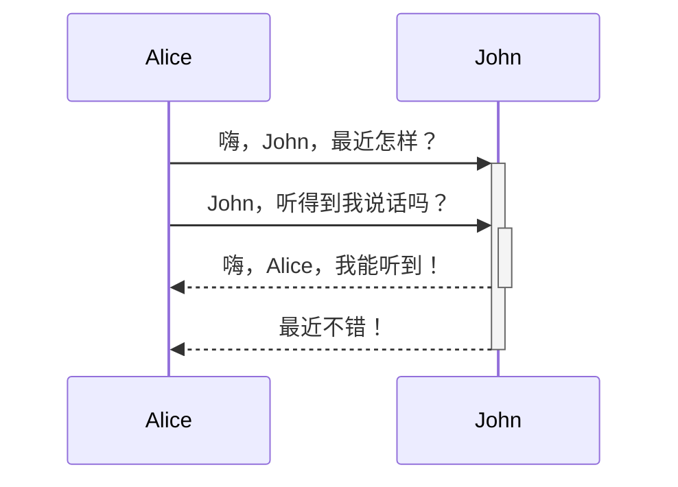

# 标题写法

# 这是小标题 1 
## 这是小标题 2 
### 这是小标题 3 
#### 这是小标题 4 
##### 这是小标题 5 
###### 这是小标题 6

---
# wiki链接：
[[局部关系图谱]]

---
# 嵌入文件：
![[git代理]]

---
# 文字格式：

*斜体*  **强调**

_你也**可以**将它们配合使用_

斜体_

__强调__

我是`行内代码`

~~删除线~~

==高亮==

<mark style="background: #FFF3A3A6;">测试高亮</mark>

---
# 列表：

- 项目一
- 项目二
	- 项目2a
	- 项目2b

1. 项目一
2. 项目二
	1. 项目a
	2. 项目b
---
# 图片大小：
![[123123.png|200]]

---

# 外部链接：
[Obsidian - Sharpen your thinking](http://obsidian.md)

---

# 引用：
> Human beings face ever more complex and urgent problems, and their effectiveness in dealing with these problems is a matter that is critical to the stability and continued progress of society. 

\- Doug Engelbart, 1961

---

#  代码块：
```js
function fancyAlert(arg) {
  if(arg) {
    $.facebox({div:'#foo'})
  }
}
```

	tab缩进也是代码块

---
# 任务列表：

- [x] 支持 #标签 ，[链接]()，**样式** 
- [x] 要求包含列表标志（有序表无序表均可，比如 `1.[x]` 同样可以） 
- [x] 这是一个已经完成的项目 
- [?] 这也是一个已完成的项目（实际上你可以在其中使用任何字符） 
- [ ] 这是一个未完成的项目 
- [ ] 在预览模式下单击选框可以切换项目完成状态

---

# 表格

|     标题2      |     标题1      |
|:--------------:|:--------------:|
| 单元格12的内容 | 单元格11的内容 |
| [[快捷键\|快捷键]] | [[格式化你的笔记\|格式化]] |

---

# 脚注：

H脚注的用法很简单，只需要在段落中需要插入脚注的地方标注一个符号，再在段落后对这个符号进行解释即可。比如这是一个简单的脚注，[^1]这是一个长一些的脚注。[^长脚注]

[^1]: 很有用！ 
[^长脚注]: 这是一个可以写长段落或者代码的地方。 
			你可以使用缩进在脚注中纳入其他段落。 
			`{ 代码 }` 
			这样你就可以在脚注中添加任意数量的段落了。
			
---

# 数学公式：

$$\begin{vmatrix}a & b\\ c & d \end{vmatrix}=ad-bc$$

---

# 注释
这里是行内注释：%%预览模式下你将看不到这句话%% 

这里是跨行注释： 
%% 
所谓跨行 
就是可以有很多行 
%%

---

# 图表




> [!info] Title 
> 
> This is a callout!

